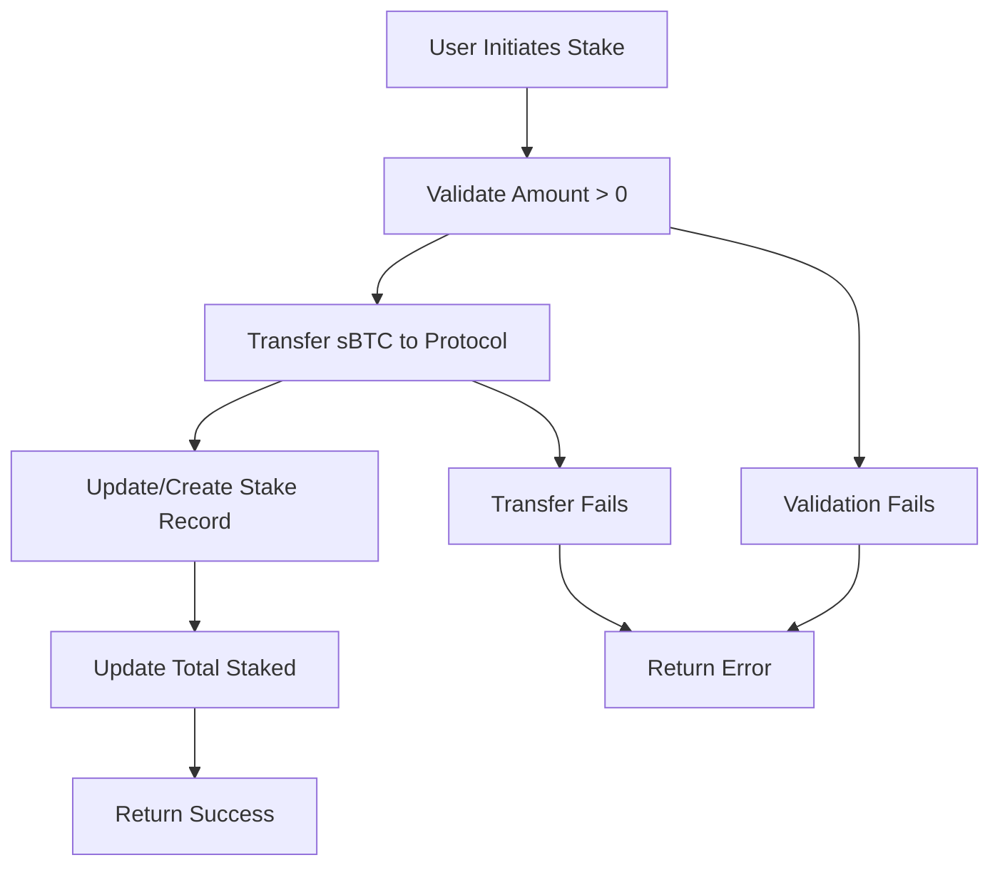
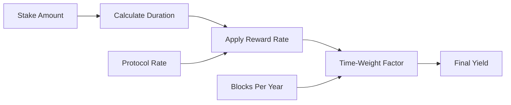
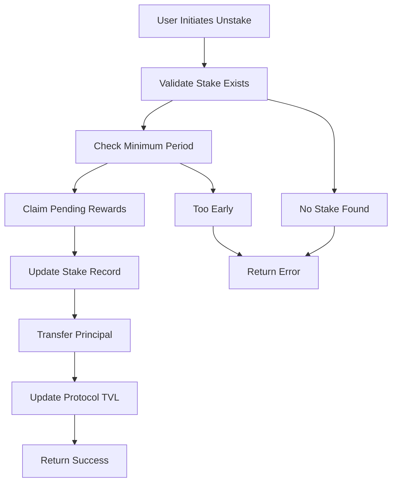

# YieldForge Protocol

> **Next-Generation DeFi Yield Optimization Platform**  
> Revolutionizing passive income generation for Bitcoin holders on Stacks Layer 2

[](https://opensource.org/licenses/MIT)
[](https://stacks.co)
[](https://clarity-lang.org)

## Overview

YieldForge transforms idle sBTC into productive assets through intelligent staking mechanisms. Users deposit sBTC and earn competitive yields while maintaining full custody control. The protocol features dynamic reward distribution, flexible withdrawal options, and automated compound growth.

### Key Features

- **🎯 Automated Yield Farming** - Sophisticated reward calculations with compounding benefits
- **⏰ Time-Weighted Returns** - Fair distribution based on staking duration and amount
- **🔒 Flexible Liquidity** - Configurable lock periods with penalty-free early claiming
- **🛡️ Security-First Design** - Comprehensive error handling and access controls
- **📊 Real-Time Analytics** - Transparent metrics and performance tracking
- **⚡ Gas Optimized** - Efficient data structures and minimal transaction costs

## System Overview

YieldForge operates as a trustless staking protocol where users deposit sBTC tokens to earn yield over time. The system implements a time-weighted reward mechanism that incentivizes long-term participation while allowing flexible liquidity management.

### Core Components

```
┌─────────────────┐    ┌─────────────────┐    ┌─────────────────┐
│   User Wallet   │    │  YieldForge     │    │  sBTC Token     │
│                 │    │   Protocol      │    │   Contract      │
│ • Stake sBTC    │◄──►│                 │◄──►│                 │
│ • Claim Rewards │    │ • Reward Calc   │    │ • Token Transfer│
│ • Unstake       │    │ • Pool Mgmt     │    │ • Balance Track │
└─────────────────┘    └─────────────────┘    └─────────────────┘
```

## Contract Architecture

### Data Structures

The protocol utilizes optimized data structures for efficient storage and retrieval:

```clarity
;; Primary staking positions
stakes: { staker: principal } → { amount: uint, staked-at: uint }

;; Reward distribution history
rewards-claimed: { staker: principal } → { amount: uint }

;; Protocol configuration
reward-rate: uint        // Basis points (5 = 0.05%)
reward-pool: uint        // Treasury balance
min-stake-period: uint   // Minimum lock period
total-staked: uint       // Protocol TVL
```

### Function Categories

#### 🔧 **Administrative Functions**

- `get-contract-owner()` - Retrieve current protocol administrator
- `set-contract-owner(principal)` - Transfer protocol ownership
- `set-reward-rate(uint)` - Adjust yield parameters
- `set-min-stake-period(uint)` - Configure lock periods
- `add-to-reward-pool(uint)` - Capitalize reward treasury

#### 💰 **Core Staking Engine**

- `stake(uint)` - Deposit sBTC for yield generation
- `calculate-rewards(principal)` - Compute accumulated yield
- `claim-rewards()` - Harvest rewards without unstaking
- `unstake(uint)` - Withdraw principal and final rewards

#### 📊 **Analytics Interface**

- `get-stake-info(principal)` - Individual position details
- `get-protocol-stats()` - Comprehensive performance metrics
- `get-current-apy()` - Real-time yield calculations

## Data Flow

### Staking Process



### Reward Calculation Flow



### Unstaking Process



## Security Features

### Access Controls

- **Owner-Only Functions**: Critical parameters protected by ownership checks
- **Input Validation**: Comprehensive validation of all user inputs
- **Safe Math Operations**: Overflow protection in all calculations

### Error Handling

- **ERR_NOT_AUTHORIZED**: Unauthorized access attempts
- **ERR_ZERO_STAKE**: Invalid zero-amount transactions
- **ERR_NO_STAKE_FOUND**: Missing staking positions
- **ERR_TOO_EARLY_TO_UNSTAKE**: Premature withdrawal attempts
- **ERR_INVALID_REWARD_RATE**: Invalid rate configurations
- **ERR_NOT_ENOUGH_REWARDS**: Insufficient treasury balance

## Economic Model

### Reward Mechanism

- **Base Rate**: Configurable annual percentage yield (APY)
- **Time Weighting**: Longer stakes earn proportionally higher rewards
- **Compound Growth**: Rewards can be claimed and restaked for compounding

### Treasury Management

- **Pool Capitalization**: Admin-controlled reward pool funding
- **Sustainable Distribution**: Rewards distributed from pre-funded treasury
- **Transparent Accounting**: All transactions recorded on-chain

## Integration Guide

### Prerequisites

- Stacks wallet with sBTC balance
- Understanding of Clarity smart contract interactions
- Basic DeFi knowledge

### Quick Start

```javascript
// Stake 1000 sBTC
await contractCall({
  contractAddress: 'PROTOCOL_ADDRESS',
  contractName: 'yieldforge-protocol',
  functionName: 'stake',
  functionArgs: [uintCV(1000000000)] // 1000 sBTC (8 decimals)
});

// Check rewards
const rewards = await callReadOnlyFunction({
  contractAddress: 'PROTOCOL_ADDRESS',
  contractName: 'yieldforge-protocol',
  functionName: 'calculate-rewards',
  functionArgs: [principalCV(userAddress)]
});
```

## Protocol Parameters

| Parameter | Default Value | Description |
|-----------|---------------|-------------|
| `reward-rate` | 5 basis points | Annual yield rate (0.05%) |
| `min-stake-period` | 1440 blocks | ~10 days minimum lock |
| `max-reward-rate` | 1000 basis points | Maximum allowable APY (10%) |

## Governance

YieldForge implements a simple governance model with the following principles:

- **Owner-Controlled**: Protocol parameters managed by designated owner
- **Transparent Changes**: All parameter updates recorded on-chain
- **Security First**: Rate limits and validation on all administrative functions

## Risk Considerations

### Technical Risks

- **Smart Contract Risk**: Potential bugs or vulnerabilities in contract code
- **Oracle Risk**: Dependency on external price feeds (if implemented)
- **Liquidity Risk**: Potential treasury depletion during high demand

### Economic Risks

- **Reward Sustainability**: Long-term viability depends on treasury management
- **Market Risk**: sBTC price volatility affects real yield calculations
- **Governance Risk**: Centralized control over protocol parameters

## License

This project is licensed under the MIT License - see the [LICENSE](LICENSE) file for details.
